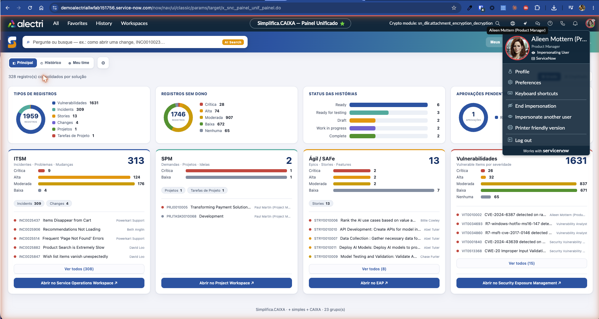
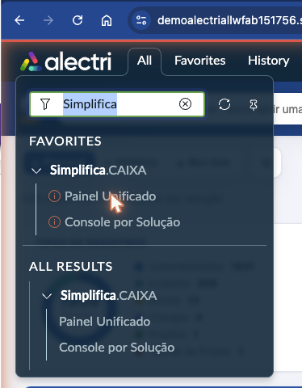
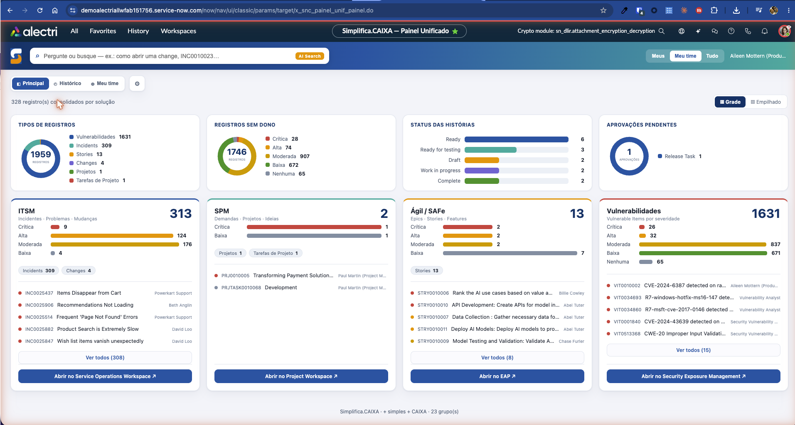

# Simplifica.CAIXA — Painel Unificado

Aplicação **scoped** ServiceNow (`x_snc_painel_unif`) que entrega uma **mesa de trabalho única**:
tudo o que está atribuído a você e aos seus grupos, reunido em um só painel — substituindo a
navegação fragmentada por listas separadas de Incident, Problem, Change, Projetos, Demandas,
histórias Agile/SAFe e itens de Vulnerability Response (VR).

A app é construída com o **ServiceNow Now SDK (Fluent)**: um frontend em **React 19** servido por
UI Pages e endpoints **REST** escritos em TypeScript (GlideRecord/GlideAggregate no server).

> **Para o time:** este repositório fica público por alguns dias para download. O passo a passo
> abaixo cobre desde a instalação do Claude Code até buildar e publicar a app na sua instância,
> e como acessar o ambiente de demonstração.

---

## Sumário

1. [Pré-requisitos](#1-pré-requisitos)
2. [Instalar o Claude Code](#2-instalar-o-claude-code)
3. [Baixar o projeto (GitHub)](#3-baixar-o-projeto-github)
4. [Instalar dependências](#4-instalar-dependências)
5. [Autenticar o now-sdk na instância](#5-autenticar-o-now-sdk-na-instância)
6. [Build & Deploy](#6-build--deploy)
7. [Acessar o ambiente de exemplo](#7-acessar-o-ambiente-de-exemplo)
8. [Estrutura do projeto](#8-estrutura-do-projeto)
9. [Scripts disponíveis](#9-scripts-disponíveis)
10. [Solução de problemas](#10-solução-de-problemas)

---

## 1. Pré-requisitos

| Ferramenta | Versão recomendada | Como verificar |
| --- | --- | --- |
| **Node.js** | 20 LTS ou superior (testado em 24.x) | `node -v` |
| **npm** | 10 ou superior (vem com o Node) | `npm -v` |
| **Git** | qualquer recente | `git --version` |
| **Conta ServiceNow** | usuário com permissão de instalar apps na instância de destino | — |

Instale o Node.js (que já traz o npm) pelo site oficial: <https://nodejs.org>.
No macOS, via Homebrew: `brew install node`. No Windows, use o instalador `.msi` do site.

> O **now-sdk** **não** precisa ser instalado globalmente — ele já vem como dependência de
> desenvolvimento do projeto (`@servicenow/sdk`) e é executado via `npx`/`npm run`.

---

## 2. Instalar o Claude Code

O **Claude Code** é a CLI da Anthropic usada para desenvolver/evoluir este projeto com IA.

```bash
# Instalação global via npm
npm install -g @anthropic-ai/claude-code

# Verifique
claude --version
```

Inicie dentro da pasta do projeto (passo 3) digitando:

```bash
claude
```

No primeiro uso, o Claude Code pede para você autenticar (login na sua conta Anthropic /
Claude). Siga as instruções exibidas no terminal.

> Alternativas: o Claude Code também está disponível como app de desktop (Mac/Windows),
> no navegador (<https://claude.ai/code>) e como extensão de IDE (VS Code, JetBrains).
> Documentação oficial: <https://docs.claude.com/claude-code>.

---

## 3. Baixar o projeto (GitHub)

Clone o repositório (público por tempo limitado):

```bash
git clone https://github.com/glauccop/painel-unificado.git
cd painel-unificado
```

> Se preferir, baixe o ZIP em **Code ▸ Download ZIP** na página do repositório e descompacte.

---

## 4. Instalar dependências

Na raiz do projeto:

```bash
npm install
```

Isso baixa React, o `@servicenow/sdk` (now-sdk), `@servicenow/glide`, TypeScript e os types
necessários, conforme o `package.json`.

---

## 5. Autenticar o now-sdk na instância

Antes de buildar/publicar, registre as credenciais da sua instância ServiceNow. Use um
**alias** (apelido) para facilitar — neste projeto usamos `demoalectri`.

```bash
# Adiciona credenciais para a instância (autenticação OAuth recomendada)
npx now-sdk auth --add https://SUA_INSTANCIA.service-now.com --type oauth --alias demoalectri

# Lista as credenciais salvas
npx now-sdk auth --list
```

> **Autenticação é interativa** (abre o navegador para login OAuth) — credenciais não ficam no
> repositório. O `mode=readwrite` exigido para publicar deve estar habilitado na instância.

A configuração da app fica em [`now.config.json`](now.config.json):

```json
{
  "scope": "x_snc_painel_unif",
  "name": "Simplifica.CAIXA",
  "tsconfigPath": "./src/server/tsconfig.json"
}
```

---

## 6. Build & Deploy

O fluxo recomendado (limpo, evitando artefatos dessincronizados):

```bash
# 1. Encerre qualquer watcher de dev em execução
pkill -f "now-sdk run dev"   # opcional, só se tiver rodado `npm run dev`

# 2. Limpe artefatos antigos
rm -rf dist target

# 3. Compile (type-check + bundle do React + geração do pacote)
npm run build

# 4. Publique na instância usando o alias configurado
npm run deploy -- -a demoalectri
```

Ao final, o terminal mostra a URL da app instalada e um link de **rollback** (para desfazer a
instalação, se necessário).

> **Importante:** sempre informe o alias no deploy (`-- -a demoalectri`). Sem o alias, o
> now-sdk pode publicar na instância default configurada, que talvez não seja a desejada.

### Modo de desenvolvimento (opcional)

```bash
npm run dev
```

Sobe um watcher que recompila e reinstala incrementalmente a cada alteração. Ao terminar,
encerre com `pkill -f "now-sdk run dev"` e faça um build/deploy limpo antes de validar.

---

## 7. Acessar o ambiente de exemplo

Há um ambiente de **demonstração** já publicado para você explorar o Painel Unificado sem
precisar buildar nada.

**URL de acesso:**

```
https://hihop.service-now.com/hop.do?sysparm_instance=demoalectriallwfab151756&mode=readwrite
```

> ⚠️ **Nota — acesso restrito:** este ambiente de demonstração só é acessível por **pessoas da
> ServiceNow** através dessa URL (autenticação via SSO corporativo). Não há acesso externo —
> não se preocupe em deixar a URL exposta no repositório.

Passo a passo no ambiente:

1. **Abra a URL** acima no navegador e conclua o login com seu SSO ServiceNow.
2. **Impersone a usuária `Aileen Mottern`** — assim você vê o painel com a carteira de
   registros dela (o painel é sempre relativo ao usuário logado/impersonado).
   - Menu do perfil (canto superior direito) ▸ **Impersonate User** ▸ pesquise
     **Aileen Mottern** ▸ confirme.
3. No **Application Navigator** (filtro de navegação), **pesquise por `Simplifica.CAIXA`**.
4. Dentro do menu **Simplifica.CAIXA**, clique no módulo **Painel Unificado**.







O painel também expõe o módulo **Console por Solução** (`x_snc_painel_unif_console.do`).

---

## 8. Estrutura do projeto

```
painel-unificado/
├── now.config.json            # Config da scoped app (escopo, nome, tsconfig do server)
├── now.prebuild.mjs           # Hook de prebuild: bundle do React (Rollup) p/ UI Pages
├── now.dev.mjs                # Config do modo dev
├── package.json               # Scripts e dependências
└── src/
    ├── client/                # Frontend React 19
    │   ├── app.tsx            # App raiz (abas: Principal, Histórico, Meu time…)
    │   ├── main.tsx           # Entrypoint do bundle
    │   ├── components/        # Componentes e views (HistoricoView, MeuTimeView, Inbox, Settings…)
    │   └── shared/            # Cliente da API REST e helpers (api.ts, visibility.ts)
    ├── server/                # Lógica de servidor (TypeScript sobre GlideRecord/GlideAggregate)
    │   ├── identity.ts        # Escopo Meus/Meu time/Todos (scopeClause)
    │   ├── summary.ts         # KPIs e contagens por tipo
    │   ├── historico.ts       # Aba Histórico (fechados por tipo/período)
    │   ├── list.ts            # Inbox unificada (lenses) com deeplinks
    │   ├── team.ts            # Aba "Meu time"
    │   └── aggregations/      # Utilitários de agregação
    └── fluent/                # Definições Fluent (metadados ServiceNow)
        ├── nav/navigation.now.ts    # Menu "Simplifica.CAIXA" + módulos
        ├── rest/painel-api.now.ts   # Rotas REST (/summary, /historico, /list, /team…)
        ├── ui-pages/painel.now.ts   # UI Page do Painel Unificado
        ├── ui-pages/console.now.ts  # UI Page do Console por Solução
        └── generated/keys.ts        # IDs gerados no build (não editar à mão)
```

---

## 9. Scripts disponíveis

| Script | O que faz |
| --- | --- |
| `npm run build` | Type-check, bundle do React e geração do pacote instalável |
| `npm run deploy` | Instala/atualiza a app na instância (use `-- -a <alias>`) |
| `npm run dev` | Watcher de desenvolvimento (recompila e reinstala incrementalmente) |
| `npm run transform` | Converte registros XML em código Fluent |
| `npm run types` | Baixa dependências/types configurados em `now.config.json` |

Type-check manual dos dois lados:

```bash
npx tsc --noEmit -p src/client/tsconfig.json
npx tsc --noEmit -p src/server/tsconfig.json
```

---

## 10. Solução de problemas

- **Deploy foi para a instância errada:** confira o alias com `npx now-sdk auth --list` e sempre
  passe `-- -a <alias>` no `npm run deploy`.
- **Artefatos dessincronizados / mudanças não aparecem:** encerre o watcher
  (`pkill -f "now-sdk run dev"`), faça `rm -rf dist target` e rode `npm run build` novamente
  antes do deploy.
- **`ModuleResolutionException` em runtime:** imports de arquivos do `server` precisam incluir a
  extensão `.ts` (ex.: `import { x } from './identity.ts'`).
- **Tela em branco após deploy:** faça um **hard refresh** (Cmd/Ctrl+Shift+R) na UI Page.

---

*Projeto desenvolvido com [Claude Code](https://docs.claude.com/claude-code).*
